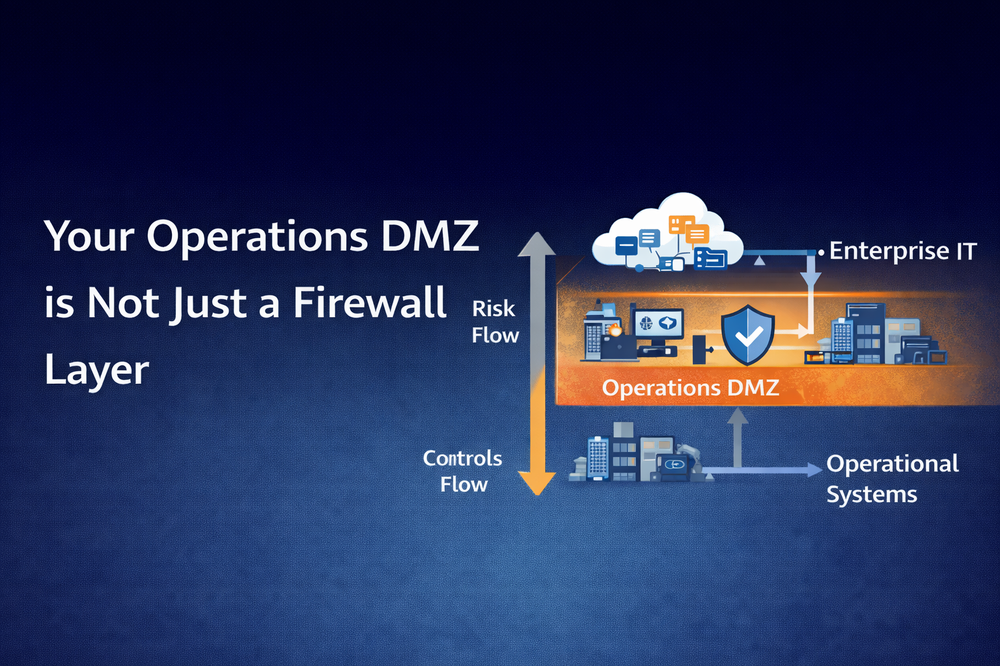

# Figure 02 — Risk Flow vs Control Flow

## Purpose

This figure illustrates the asymmetric behavior of risk and control in IT/OT and industrial systems.

## Key Concepts

- Risk propagates downward toward physical process and consequence
- Controls propagate upward to intercept, mediate, and constrain risk
- Effective security architecture depends on correct placement of controls

## Architectural Implication

Controls placed downstream of risk propagation are forced to compensate rather than prevent.

This figure is a canonical reference within the Architecture-Driven GRC Framework.

