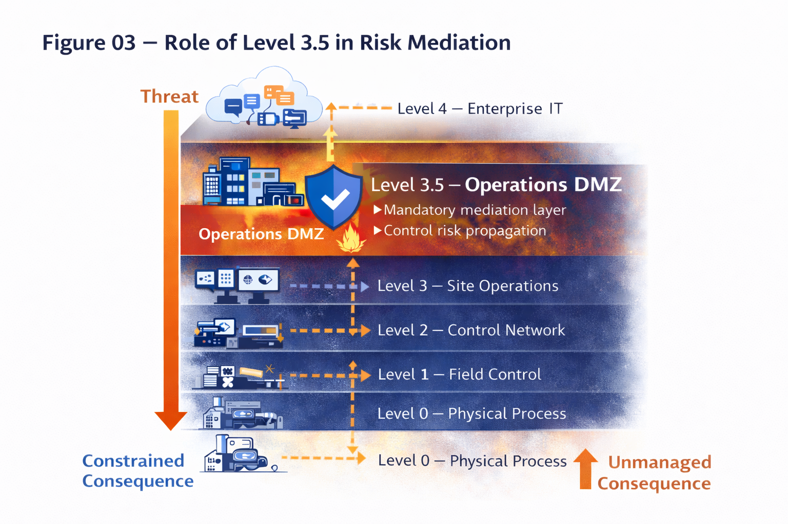

# Figure 03 — Role of Level 3.5 in Risk Mediation

## Purpose

This figure defines Level 3.5 (Operations DMZ) as the architectural hinge point in the Architecture-Driven GRC Framework.

It illustrates where enterprise-originated risk must be transformed, terminated, or blocked before reaching operational and control domains.

## Key Concepts

- Level 3.5 is the last domain where upstream risk can be mediated
- It is the first domain responsible for constraining operational risk
- It is the only domain permitted to interact bidirectionally across IT and OT

## Failure Implications

If Level 3.5 fails to remediate risk:
- Risk passes unchanged into operations
- Downstream controls are forced to compensate
- Severity increases non-linearly
- Safety and availability assumptions degrade

This figure is a canonical reference and must not be altered without framework review.
