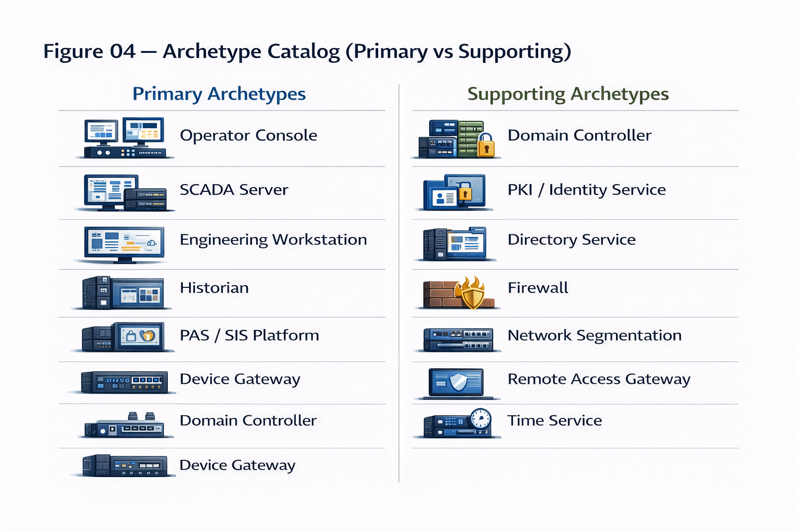

# Figure 04 — Archetype Catalog: Primary vs Supporting

## Purpose

This figure defines the archetype taxonomy used by the Architecture-Driven GRC Framework.

Archetypes represent persistent architectural system roles that participate in trust relationships and contribute to deterministic risk patterns.

## Archetype Classes

### Primary Archetypes

Primary archetypes:
- Present direct attack surfaces
- Influence operational or control behavior
- Can independently initiate risk patterns
- Reside within specific Purdue risk domains

Examples include:
- Operator Console
- SCADA Server
- Engineering Workstation
- Historian
- PAS / SIS Platform
- Device Gateway

### Supporting Archetypes

Supporting archetypes:
- Do not directly control industrial process
- Enable, sustain, or amplify trust relationships
- Are depended upon by primary archetypes
- Influence the severity and spread of failures

Examples include:
- Domain Controller
- PKI / Identity Service
- Directory Service
- Firewall
- Network Segmentation Infrastructure
- Remote Access Gateway
- Time Service

## Architectural Implication

Risk patterns emerge from interactions between primary and supporting archetypes.

Controls must therefore address both archetype classes to be effective.

This figure is a canonical reference and must not be altered without framework review.
